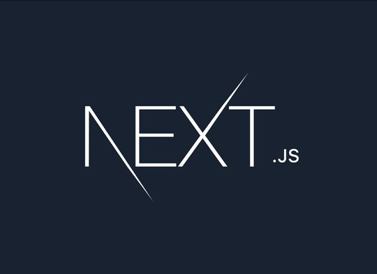

### Hi there, I'm Jatin 👋

### About Me 

I like to mix things up from Web Development to UI/UX Designing, Graphic Designing from scratch. I'm also thinking about trying Dev Ops and Game Development.

**Technologies i like working with**

 
 
 

### More About Me  

<!--- **🔭 I’m currently working on :**  
  
  a project for Imagine Cup 2021 focussed on accessibilities during video conferencings  
  https://github.com/connecting-hands/connecting-hands -->
  
- **🌱 I’m currently learning :**
    
        
    
    

- **📫 How to reach me :**  

    Email me at jatin4762@gmail.com
    
- **😄 Pronouns :** He/Him
- **⚡ Fun fact :** Really like watching Anime and Web series

  <!--(PS: My favorite reposity is https://github.com/ayushkumar121/Fairy-Engine)-->

 

> Most of my repositories are result of my experiments after visiting torrent courses and projects section.

## GitHub Stats

  
  

  
  

<!--
**Jatin965/Jatin965** is a ✨ _special_ ✨ repository because its `README.md` (this file) appears on your GitHub profile.

Here are some ideas to get you started:

- 🔭 I’m currently working on ...
- 🌱 I’m currently learning ...
- 👯 I’m looking to collaborate on ...
- 🤔 I’m looking for help with ...
- 💬 Ask me about ...
- 📫 How to reach me: ...
- 😄 Pronouns: ...
- ⚡ Fun fact: ...
-->
